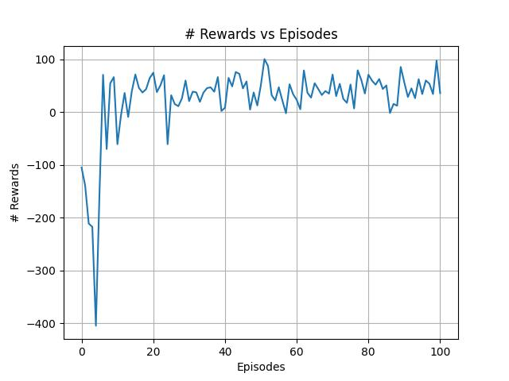
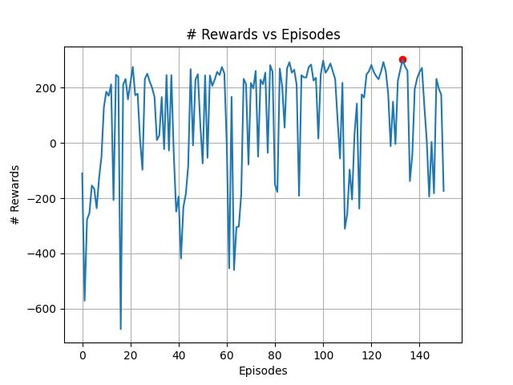
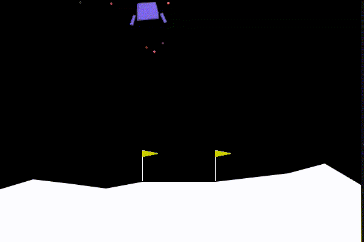
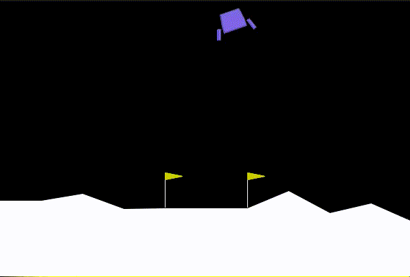
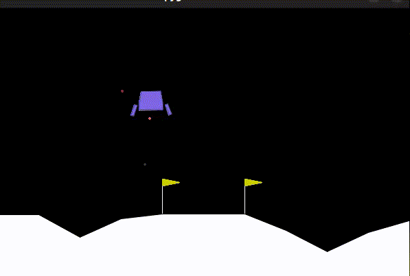

## Lunar Lander enviroment using DeepQlearning

<div align="center" style="max-width:68rem;">
<table>
  <tr>
    <td align="center"><a href="https://github.com/matheus-1618"><br /><sub><b>Matheus Oliveira</b></sub></a><br /><a href="https://github.com/matheus-1618" title="Matheus Silva M. Oliveira"></a> Developer</td>
   <td align="center"><a href="https://github.com/niveaabreu"><br /><sub><b>Nívea de Abreu</b></sub></a><br /><a href="https://github.com/niveaabreu" title="Nívea de Abreu"></a>Developer</td>
      <td align="center"><a href="https://github.com/leticiacb1"><br /><sub><b>Letícia Côelho</b></sub></a><br /><a href="https://github.com/leticiacb1" title="Letícia Côelho"></a>Developer</td>

  </tr>
</table>
</div>

## To run the models

Installing all the dependencies (create a virtualenv to it):
```python
pip install -r requirements.txt
```

To train our implementation:
```python
python3 LunarLander.py -t -a 1
```

To train the DQN Stable_Baselines3 model:
```python
python3 LunarLander.py -t -a 0
```

To run our saved model:
```python
python3 LunarLander.py
```
## Description of the enviroment

The enviroment consist of space ship trying to landing in the moon, between two flags.
The action space consist of 4 actions:
* 0: do nothing

* 1: fire left orientation engine

* 2: fire main engine

* 3: fire right orientation engine

The Observation Space consist of an 8-dimensional vector: the coordinates of the lander in x & y, its linear velocities in x & y, its angle, its angular velocity, and two booleans that represent whether each leg is in contact with the ground or not.

## Learning curve
As seen in the figure below, the model presents great oscilation, having interpersed peaks and valleys.
Despite its strangeness, this behavior is expected according to the literature [Mnih,2013](https://arxiv.org/abs/1312.5602), the one that based this project.

**You can see this implementation in the DeepQlearning.py file**.

<div align="center" style="max-width:68rem;">

</div>

Training again the model, but this time with 150 episodes we've obtained almost the same behavior. The biggest difference is that we've saved the model at the best score achieved (red point in the plot), giving an agent that is more capable of land sucessfully in most cases.

<div align="center" style="max-width:68rem;">

</div>

## Behavior of the agent

The two animations below represent two stages of the agent. 
* In a middle point of the training, when the agent take bad decisions where this one even came close to the flags.

<div align="center" style="max-width:68rem;">

</div>

* After the complete training, where the agent yet cannot complete all the times the enviroment (land sucessfully), but has a visible better perfomance, reaching near the flags and and showing less oscillations in its flight.

<div align="center" style="max-width:68rem;">

</div>

## Comparing results against Stable_Baselines3 Model
Stable_Baselines3 is a library builtin python that implements DeepQLearning in its module. All the dependencies are in requirements file.

**You can see this implementation in the DeepQlearning_StableBaseline.py file**.

With this implementation, we could get an great result seeing the agent in action, as we can see in the animation below:

<div align="center" style="max-width:68rem;">

</div>

Stable was also great in terms of perfomance and velocity of training. While our implementation took about 40-60 minutes to train 100-150 episodes, Stable trained 100000 in less than 10 minutes, and without occupying more than 15% of the computer's available memory (which occurred in most cases of our implementation). 

Since Stable has not built-in methods to return teh learning of the agent against the episodes, was not possible to plot a learning curve. Anyway, was possible to see that it's a good alternative to implement DeeQlearning as it's a easy library to instanciate and modificate, in addition to not requiring much computational power to run.

## Sources
The implementation of BaseLines3 Library was bases in this [source](https://deeplearning.neuromatch.io/projects/ReinforcementLearning/lunar_lander.html)
