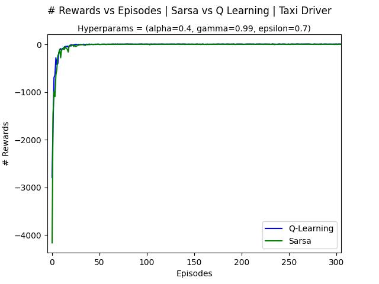

# Sarsa and Q-Learning

Student: Matheus Silva Melo de Oliveira

## * Which algorithm has the best results for the taxi-driver environment?
As can be seen from the graph below, both models show similar learning patterns for this enviroments and with this Hyperparameters selection (alpha=0.4, gamma=0.99, epsilon=0.7). It's still remarkable that Sarsa model has more oscillations in it's curve than the Q-Learning model, showing a clue about which model  is possibly better for this case.

 

Concurrently, running 10 times both models for simillar situations in the simulation folder (where there are simulations files and its outputs), the following results was obtained:

> In 10 times, the mean of actions taken by Q_learning was: 12.9

> In 10 times, the mean of actions taken by Sarsa was: 13.1

With this data, it can be seen that apparently, Q-Learning need less actions to accomplish its goal, which indicating that it performs better in this specific case with these hyperparams as well.

## *Which algorithm has the best results for the Cliff Walking environment?
In the same way that in taxi-driver environment, Cliff Walking has a similar behavior. Using the same triple of Hyperparams that in scenario above (alpha=0.4, gamma=0.99, epsilon=0.7), it's visible that in the first episodes Q-Learning has more oscillations than Sarsa, but in a higher number of episodes (>100) it's remarkable that Q-Learning is more stable than Sarsa.

 

Again, simulating 10 times different situations for the models, becomes even more visible that Q_learning take less actions to accomplish it's goal to reach the cookie than Sarsa, indicating that over again, it's a better choice in this context.

> In 10 times, the mean of actions taken by Q_learning was: 13.0

> In 10 times, the mean of actions taken by Sarsa was: 17.0

## *Try to explain the results. Why one algorithm is better than another?
By it's equations, is possible to see that Q-learning choose it's next actions choosing the maximum Q-value for the state, which is a greedy decision, and possibly for scenarios with less actions to taken like thw two perfomed above, this tends to get best paths of resolutions. Otherwise, as Sarsa with it's on-policy algorithm, it learns action values relative to the policy it follows, and in these specific cases, usually it can significate in longer and sometimes even unnecessarily long paths.

## * Do a small research about Sarsa algorithm to understand its cons and pros.

### Pros:
* Attempt to evaluate or improve the policy that is used to make decisions

* Often use soft action choice, i.e. π(s,a)>0,∀a,

* Commit to always exploring and try to find the best policy that still explores

* Great to a big set of actions, deciding next actions with higher grade

### Cons:

* May become trapped in local minima.

* Sarsa is more conservative. An example is walking near the cliff. QL will take the shortest path because it is optimal (with the risk of falling), while SARSA will take the longer, safer route (to avoid unexpected falling).

[Source](https://towardsdatascience.com/intro-to-reinforcement-learning-temporal-difference-learning-sarsa-vs-q-learning-8b4184bb4978)