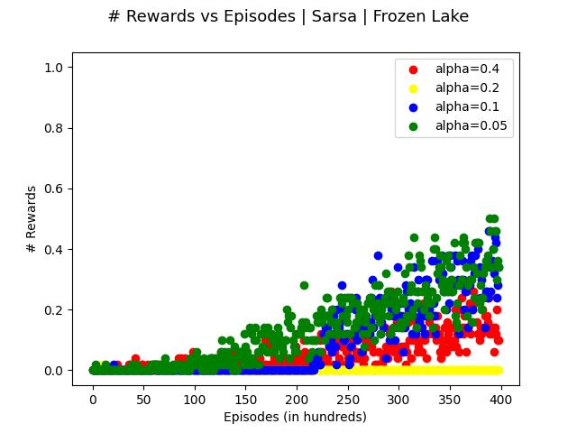
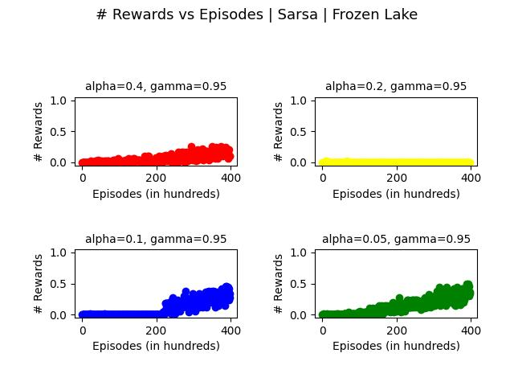

# Projeto para testar uma implementação para o FrozenLake 8x8

Considere o ambiente FrozenLake 8x8 versão não-determinística. Implemente um agente capaz de chegar ao objetivo final em pelo menos 80% das vezes. Para implementar este agente você pode utilizar o algoritmo *Q-Learning* ou *Sarsa* com os hiperparâmetros que você considerar melhor. 

Você deve adicionar neste projeto e fazer o commit dos seguintes artefatos: 

* o arquivo `q-table.csv` dentro do diretório `data`. Já existe um arquivo q-table neste projeto, mas ele é para a versão do ambiente 4x4. Quando você executar o arquivo `test_frozenlake.py` usando o comando `pytest`irá ocorrer um erro de `IndexError`. Você deve substituir este arquivo pelo arquivo gerado pelo seu agente durante o período de treinamento; 

* depois de substituir o arquivo `data/q-table.csv`, você poderá executar os testes e verificar se o mesmo é aprovado em todos os testes. São quatro testes: o primeiro executa o ambiente 1000 vezes e verifica se o agente conseguiu chegar ao final em no mínimo 700 vezes. Os outros 3 testes fazem exatamente a mesma coisa: executam o agente no ambiente 1000 vezes e verificam se o agente conseguiu chegar ao final em no mínimo 800 vezes;

* você também deve adicionar a sua implementação no diretório raiz deste projeto, e;

* alterar este arquivo README.md informando os hiperparâmetros utilizados para o treinamento. 

* (critério para A+) apresentar um gráfico comparando a curva de aprendizagem de diversas abordagens utilizadas durante o treinamento. 

## Algoritmo e hiperparâmetros utilizados para o treinamento

 

| Atributo        |  Valor     |
|:----------------|:----------:|
| Algoritmo       |    Sarsa        |
| alpha           |      0.05      |
| gamma           |          0.95  |
| epsilon         |         0.95  |
| epsilon_dec     |        0.0001     |
| epsilon_min     |        0.9999    |
| qtd_episodios   |         20000   |

## Comparação entre abordagens
Conforme a seleção de hiperparâmetros acima, é notório pelos gráficos abaixo, que dado uma menor taxa de aprendizado aos próximos estados, melhor o agente consegue lidar com as situações não determinísticas geradas pelo fator de escorregamento do mapa. 
Dessa maneira torna-se possível visualizar-se a capacidade deste modelo que um alto fator de desconto aliado a um valor alto de fator de exploração permitem ao agente entender melhor cenários futuros e avaliar dentre as probabilidade entender com um pouco mais de cautela, as melhores ações a serem tomadas, gerando assim uma maior taxa de aproveitamento conforme elucidado pelos gráficos de média das recompensas a cada 50 episódios.

 

 

